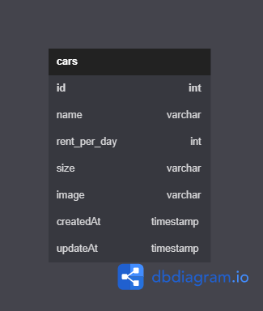
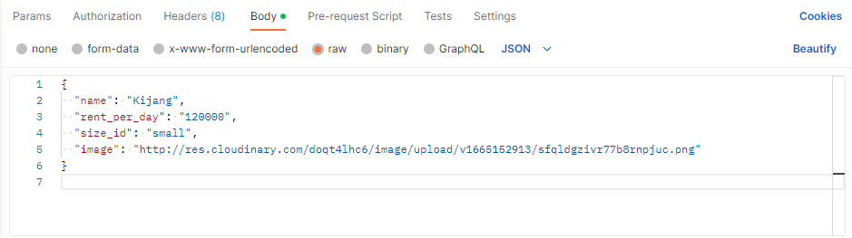
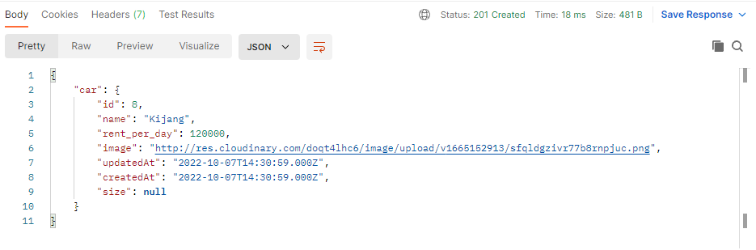

# Car Mangement Dashboard

Nanda Julian Lubis.

Car Management Dashboard is a challenge from chapter 5, study independent of Fullstack Web Development Binar Academy.

## Features

- Car Management Dashboard
- List Cars
- Add new Car
- Update car data
- Delete car

## Tech

in this project, i use several tech including::
- Html
- CSS
- Javascript

and some library / framework :
- Bootstrap - CSS Framework
- NodeJS - Javascript Runtime
- ExpressJS - NodeJS HTTP Server Framework

## ERD

## EndPoint

### User
- "http://localhost:8000/" , get =  Index || list Cars data
- "http://localhost:8000/add-car" , get = handle Add Car
- "http://localhost:8000/add-car" , post = handle Insert Car
- "http://localhost:8000/edit-car/:id" , get = handle Edit Car
- "http://localhost:8000/update-car/:id" , post = handle Update Car
- "http://localhost:8000/delete-car/:id" , get = handle Delete Car

### API
- "http://localhost:8001/cars" , get = handle List cars
- "http://localhost:8001/cars" , post = handle Insert cars
- "http://localhost:8001/cars/:id" , get = handle get one car
- "http://localhost:8001/cars/:id" , put = handle update car data
- "http://localhost:8001/cars/:id" , delete = handle Delete car data

### Request Body

### Response Body

## How to install project
- Download or clone the repository
- install dependencies in frontend and backend with "npm install"
- configure your postgres user in backend/config/config.json
- run "sequelize db:create" in backend to create database
- run "sequelize db:migrate" in backend to migrate table
- run "sequelize db:seed:all" in backend to seeding data
- run "npm run start" in each backend and frontend to run project
- open "localhost:8000/" and enjoy the project

##### Thank's for your visit
